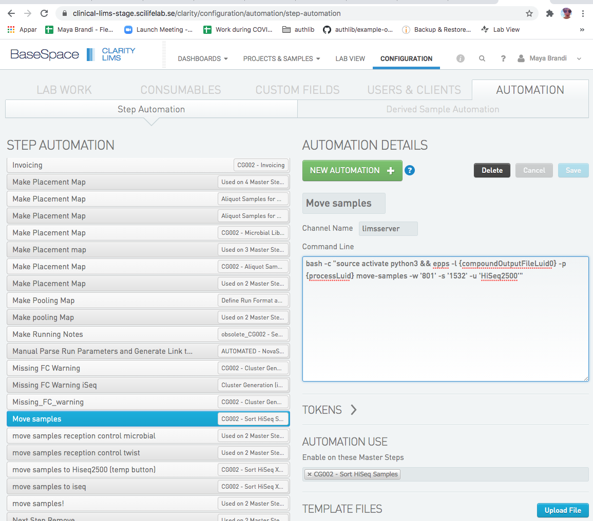
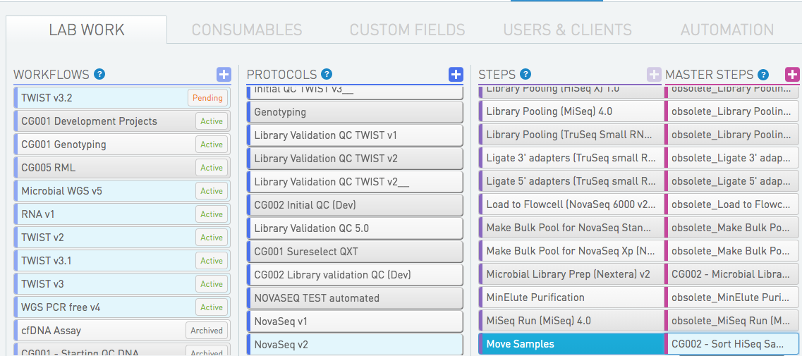
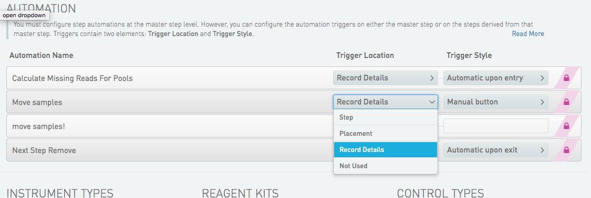
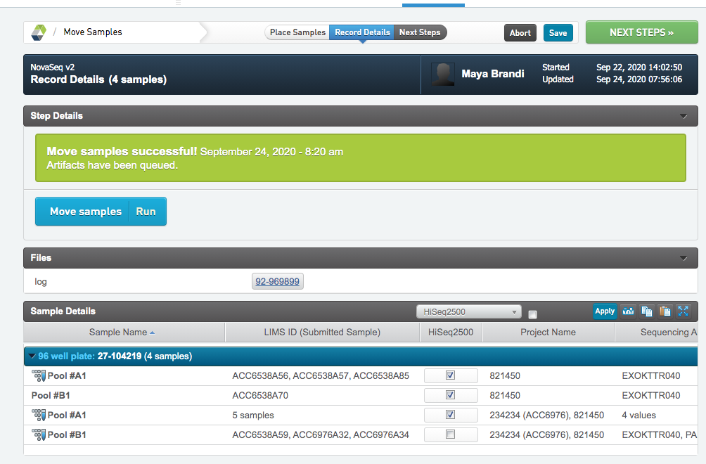

# cg_lims [](https://coveralls.io/github/Clinical-Genomics/cg_lims?branch=master) [](https://travis-ci.org/Clinical-Genomics/cg_lims) 

A new package for lims interactions. The aim is to replace all other lims interactions at CG with this new package.

## Database access
The lims ststem is built upon a postgress database. Illumina provides a [REST API](https://clinical-lims-stage.scilifelab.se/api/v2/) for accessing the database. On top of that there is a python API, the [genologics](https://github.com/SciLifeLab/genologics) packge wich simply translates the rest into python. cg_lims is hevily depending upon the genologics python API. 

## Branching model

cg_lims is using github flow branching model as described in our development manual.


## Config files
   
The genologics package requires a config: **~/.genologicsrc**
Read about this [here](https://github.com/SciLifeLab/genologics).


## Production and Stage

The production lims system is set up on hippocampus and the stage lims system is set up on amygdala.

ssh into the servers:

`ssh gls@clinical-lims-stage.scilifelab.se`

`ssh gls@clinical-lims.scilifelab.se`

You will need a password wich is kept in the safety locker at clinical genomics.

Testing of new code or new workflows takes place on the stage server.


## About EPPs

The External Program Plug-in (EPP) is a script that is configuerd to be run from within a lims step.

Clinical Genomics LIMS is using both scripts that are developed and maintained by Genologics, and scripts that are developed by developers at Clinical Genomics. Scripts developed and maintained by Clinical Genomics are located in [cg_lims/cg_lims/EPPs](https://github.com/Clinical-Genomics/cg_lims/tree/master/cg_lims/EPPs).

Development of new EPPs is preferably done locally but the final testing is done on the stage server.


### Install
The procedure for installing is the same on both servers.

Curently cg_lims is cloned into `/home/glsai/opt/` and installed by the glsai user under the conda environment `cg_lims`.

```
sudo -iu glsai
source activate cg_lims
pip install -U "git+https://github.com/Clinical-Genomics/cg_lims@<branch name>"
```
The branch that has been installed is now avalibe from within the [lims web interface](https://clinical-lims-stage.scilifelab.se/clarity/).

Test it from the command line:

```
(python3)glsai@clinical-lims-stage:~$ epps --help
Usage: epps [OPTIONS] COMMAND [ARGS]...

Options:
  -l, --log TEXT      Path to log file.  [required]
  -p, --process TEXT  Lims id for current Process.  [required]
  --help              Show this message and exit.

Commands:
  move-samples              Script to move aritfats to another stage.
  place-samples-in-seq-agg  Queueing artifacts with given udf==True, to...
  rerun-samples             Script to requeue samples for sequencing.
```


### Configure EPPs

The branch with the new script has been installed and you want to test the script through the web interface. (Or deploy it to production. The procedure is the same.)

Let us call the new script we want to test: `move-samples`. Running it from the command line looks like this:

```
(python3)glsai@clinical-lims-stage:~$ epps -p 'some-process' -l 'log' move-samples  --help
Usage: epps move-samples [OPTIONS]

  Script to move aritfats to another stage.

  Queueing artifacts with <udf==True>, to stage with <stage-id> in workflow
  with <workflow-id>. Raising error if quiueing fails.

Options:
  -w, --workflow-id TEXT  Destination workflow id.  [required]
  -s, --stage-id TEXT     Destination stage id.  [required]
  -u, --udf TEXT          UDF that will tell wich artifacts to move.
                          [required]

  -i, --input-artifacts   Use this flag if you want to queue the input
                          artifacts of the current process. Default is to
                          queue the output artifacts (analytes) of the
                          process.

  --help                  Show this message and exit.

```

When the script is configured in the lims step, arguments bust be replaced by `tokens`. They function as placeholders that are replaced with actual values at runtime. You can read more about tokens [here](https://genologics.zendesk.com/hc/en-us/articles/115000028563-Step-Automation-Tokens.

To make the new script avalible in the [web interface](https://clinical-lims-stage.scilifelab.se/clarity), go to the `CONFIGURATON` tab and then select `AUTOMATION`. Klick the `NEW AUTOMATON` button.

- Choose a Automation Name
- Channel Name should always be `limsserver`.
- Enter the command line string. If you need help selecting a token for an argument, klick the `TOKENS` tab wich will show the list of avalible tokens. In this case the string is
`bash -c "source activate python3 && epps -l {compoundOutputFileLuid0} -p {processLuid} move-samples -w '801' -s '1532' -u 'HiSeq2500'"`
- Under `AUTOMATION USE`, select master step(s) in which the new EPP should be available.
- Save





Once the EPP is in place on the master step you need to configure its usage. This can be done both on master step and on step level. 

Klick the `LAB WORK` tab and select a step in which you have enabeled the EPP. 





Choose `STEP` or `MASTER STEP`, and scroll down to the `AUTOMATION` section. The new EPP should be seen there. 





Select Trigger Location - at what point in the step the script should be run, and Trigger Style - how the script should be triggered.

The script is now avalible from within the step. Queue some samples to the step to try it!



Read more about EPPs in the [Clarity LIMS API Cookbook](https://genologics.zendesk.com/hc/en-us/restricted?return_to=https%3A%2F%2Fgenologics.zendesk.com%2Fhc%2Fen-us%2Fcategories%2F201688743-Clarity-LIMS-API-Cookbook)


### Trouble shooting

When a script is failing, usually as a developer, you will get this information from the lims user who has run the script from within a specific lims step. It´s easiest to trouble shoot if the step is still opened.

**Trouble shooting - step by step:**
* Ask the user to keep the step opened for you to trouble shoot, if possible. (Sometimes they need to continue the step)
* Go to the step to see what EPP was failing. The name of the EPP is the label on blue button. In this case: **1. Copy UDFs from AggregateQC - Twist**
* Go to configuration/automation in the web interface and search for the button name. There might be many buttons with the same name. Find the button that is active in the masterstep tht you are debugging. 
* The issue can be in how the script has been configured (the "command line" text box), it can be some bug in the script, or it can be that the script is expecting the artifacts/process/samples/containers or whatever has some fields or features that are not in place. 
* One way to debug is to run the script from command line. ssh into productuoin as described above and run the script with the same argument that are given in the "command line" text box. The process id {processLuid} is allmost allways asked for. 


`{processLuid} = <prefix>-<the last section of the url of the step>` 

In this case: 24-144356. 
  
Prefixes:

24- for configured processes

122- for pooling processes

151- for indexing/reagent tag processes

```
cd /home/glsai/opt/cg_lims/EPPs/
python copyUDFs_from_aggregateQC.py -p '24-144356' -l testlog -u 'Concentration' 'Amount (ng)' -q 'Aggregate QC (DNA) TWIST v1'
```


### Scripts developt by Illumina
In our Clinical Genomics lims system we are also using a fiew scripts that are developed and maintained by Illumina.
Programs written and maintained by Illumina are located in

Java scripts:
`/opt/gls/clarity/extensions/ngs-common/`

Python scripts:
`/opt/gls/clarity/customextensions`

Don't thouch these directories. Insted, if a script developed by Illumina is failing, contact them for help support. 


